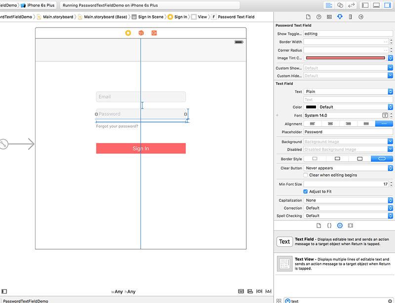

[](https://travis-ci.org/PiXeL16/PasswordTextField/) [](https://codecov.io/github/PiXeL16/PasswordTextField?branch=master) [](https://img.shields.io/cocoapods/v/PasswordTextField.svg) [](https://github.com/Carthage/Carthage) [](https://raw.githubusercontent.com/PiXeL16/PasswordTextField/master/LICENSE)

# PasswordTextField
A custom TextField with a switchable icon which shows or hides the password and enforces good password policies,  written in `Swift`.


:star: Features
---
* Custom toggle icon in IB or programmatically.
* Custom icon color in IB or programmatically.
* Custom password validation rules.
* Custom password validation error message.
* Control when to show the icon, while editing, always or never.

:octocat: Installation
---
Get `PasswordTextField` on CocoaPods, just add `pod 'PasswordTextField'` to your `Podfile` and then run `pod install`. You can also add the Github to your `Carthage` file.

:metal: Usage
---
1. Open a storyboard or Xib file.
2. Drag and drop a `UITextField` to a ViewController.
3. In Identity Inspector, replace the class from `UITextField` to `PasswordTextField`
4. Configure your properties in the Attribute Inspector.



## Properties

| Property name | Data type | Remark |
| ------------- |:-------------:| ----- |
| Show Toggle Button While | String | Possible values are `editing`(default), `always`, `never` |
| Image Tint Color | UIColor | The color off the Toggle image, the functionality use `UIImageRenderingMode.AlwaysTemplate` to change the default or custom image color|
|Custom Show Secure Text Image| UIImage| Your custom image to show the secure text|
|Custom Hide Secure Text Image| UIImage| Your custom image to hide the secure text|

## Validation

`PasswordTextField` also provides functionality to enforce good password policies.

It will currently validate that the password format is `at least 8 characters long and contain one uppercase letter and one number`.

```swift
import PasswordTextField

if passwordTextField.isInvalid(){
  print(passwordTextField.errorMessage)
}
```

You can also provide your custom password validation format (with Regex) and error message:

```swift
import PasswordTextField

let validationRule = RegexRule(regex:"^[A-Z ]+$", errorMessage: "Password must contain only uppercase letters")

passwordTextField.validationRule = validationRule

if passwordTextField.isInvalid(){
  print(passwordTextField.errorMessage)
}
```

TODO
-----
* Show indication when password is strong or weak in TextField
* Animation when toggling Button


:alien: Author
------
Chris Jimenez - http://code.chrisjimenez.net, [@chrisjimeneznat](http://twitter.com/chrisjimeneznat)

## License
`PasswordTextField` is released under the MIT license. See [LICENSE](https://github.com/pixel16/PasswordTextField/blob/master/LICENSE) for details.
